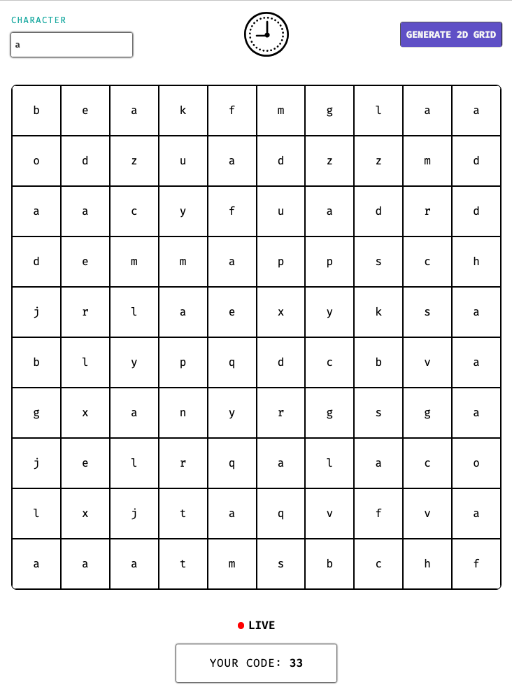

## Tech Stack

* Backend: Node (v23.6.0) | Express | Vitest | Zod
* Frontend: Angular | Jasmine | Karma

## Install Dependencies

* PNPM Workspaces should cover the dependencies. 
* Just run the following command on the project root.

> command: pnpm install

## Backend Tests

* Both the providers and the schema are covered by tests.
* Navigate to the backend folder and run following command.

> command: pnpm run test

## Frontend Tests

* All the components are covered by tests.
* Navigate to the frontend folder and run following command.

> command: pnpm run test

## Screenshot

